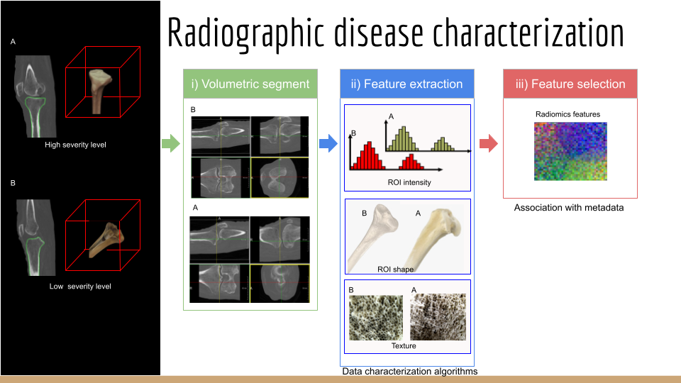

# Challenge 1: Disease Classification
You are provided with two patient cases with varying disease severities, patient A has a low severity level and patient B a high severity level. Your task is to use basic image processing to extract features that could be used as markers of disease level. Then use a basic statistical analysis on these features to decide which are the best markers of disease. Whilst no test set is provided, you can assume that these cases are representative of their respective classes. To complete this challenge, you should use the CT scans (you may also want to use the segmentations) and to keep things simple, you should only look at the tibia. Once complete, please prepare a short (3-5 minutes max) presentation on your solution. You should target a non-expert (i.e., no image processing knowledge) audience. Imagine you are trying to convince a marketing manager that you have found the best way to classify disease level in the tibia.

# Challenge 2: Surgical Planning
During joint replacement surgery, unhealthy bone is removed (bone re-sectioning) to make place for an implant. Firstly, you should calculate a (binary) mask of the bone that will be removed and use this to isolate the voxels (3D pixels) that are removed during surgery (as well as those that won’t). Then, you should use the features you investigated in challenge 1 to decide if the bone that is removed is diseased and if the bone that remains is healthy. Ultimately, you should decide whether the two patients are good candidates for joint replacement surgery. Again, to keep things simple you should focus on the tibia only. 
Where the robot cuts the femur is defined by a cutting plane (see CuttingPlaneExample.png) and is given to you in a .txt file. The file contains a list of point coordinates (x, y, z). Unfortunately, the coordinates are in the robot coordinate frame (RCF), whilst the CT and segmentation are in the image coordinate frame (ICF). Before you can calculate your mask, you must project/transform the cutting plane points from the RCF into the ICF, so they align with the CT. To do this, you are given the scaling and translation parameters of the transformation from the ICF into the RCF.

# Solution

[More info](https://docs.google.com/presentation/d/1L3ZMRtjEY-gRkPHrG-GGYYt0x0PYmp3ITX8GWua2_k0/edit?usp=sharing)
